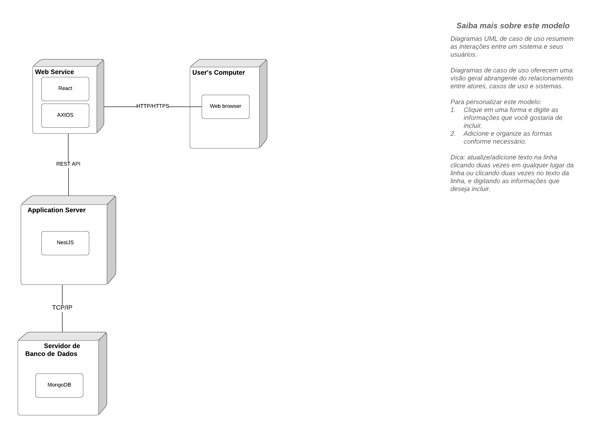

# Diagrama de Implantação

## Introdução

 &emsp;&emsp;O diagrama de implantação, criado em UML, tem como objetivo representar a arquitetura física de um sistema, demonstrando a disposição dos elementos de software sobre os recursos de hardware. Ele proporciona uma visão clara sobre como os componentes de software são alocados em servidores, dispositivos e redes, facilitando a compreensão da infraestrutura necessária para o funcionamento do sistema. Além disso, por ser desenvolvido em UML, o diagrama é flexível, podendo descrever sistemas implementados em qualquer linguagem de programação. 
&emsp;&emsp;O diagrama de implantação é útil para documentar a estrutura física do sistema, ajudando a identificar a interação entre hardware e software de forma clara e objetiva.

## Metodologia

&emsp;&emsp;A equipe responsável pelo Diagrama de Implantação reuniu-se para analisar os requisitos previamente levantados no projeto. Com base nessa análise, foram identificados os principais componentes do web-app e elaborado o diagrama, alinhado aos requisitos funcionais e às necessidades da aplicação.

&emsp;&emsp;A confecção do diagrama foi feita utilizando o software <a href="https://www.bizagi.com/pt/plataforma/modeler" target="blank">Bizagi Modeler</a>.

## Diagramas

<figcaption align='center'>
    <b>Figura 1: Diagrama de Implantação </b>
     
</figcaption>

Fonte: [Guilherme](https://github.com/gmeister18), [Samuel](https://github.com/samuelalvess) e [AnaGH](https://github.com/analufernanndess), 2024.

## Gravação da reunião

<iframe width="560" height="315" src="https://www.youtube.com/watch?v=FpoC4CNPS9c" title="YouTube video player" frameborder="0" allow="accelerometer; autoplay; clipboard-write; encrypted-media; gyroscope; picture-in-picture; web-share" referrerpolicy="strict-origin-when-cross-origin" allowfullscreen></iframe>

## Bibliografia

> BOOCH, Grady; RUMBAUGH, James; JACOBSON, Ivar. The Unified Modeling Language User Guide. 2nd ed. Boston: Addison-Wesley, 2005.

## Histórico de Versão

| Versão | Data | Descrição | Autor | Revisor
|:-:|:-:|:-:|:-:|:-:|
|`1.0`| 19/11/2024 | Criação do documento| [GuilhermeGH]| |

[AnaGH]: https://github.com/analufernanndess
[CainaGH]: https://github.com/freitasc
[ClaudioGH]: https://github.com/claudiohsc
[EliasGH]: https://github.com/EliasOliver21
[GuilhermeGH]: https://github.com/gmeister18
[JoelGH]: https://github.com/JoelSRangel
[KathlynGH]: https://github.com/klmurussi
[PabloGH]: https://github.com/pabloheika
[PedroRH]: https://github.com/pedro-rodiguero
[PedroPGH]: https://github.com/Pedrin0030
[SamuelGH]: https://github.com/samuelalvess
[TalesGH]: https://github.com/TalesRG