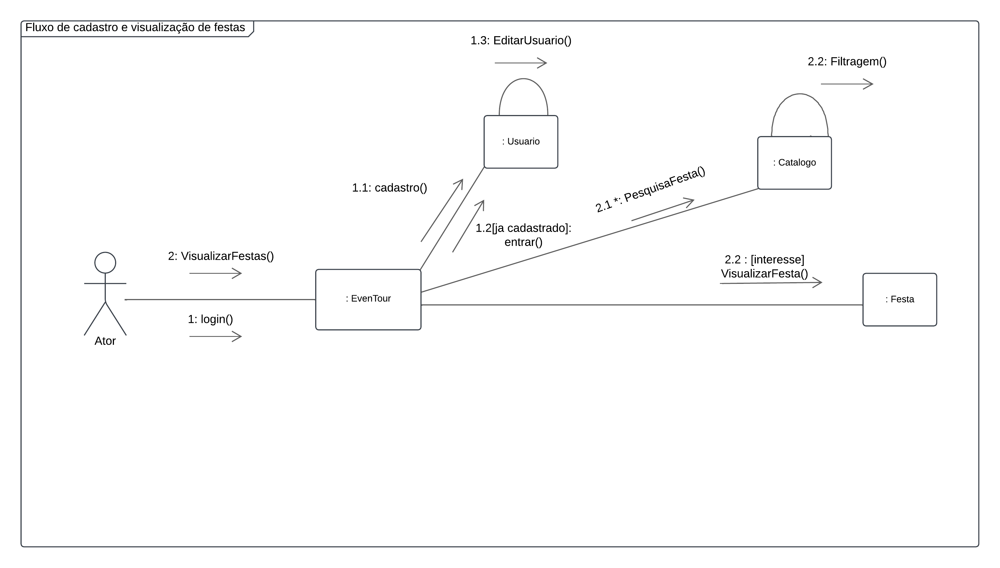

# 2.2.3 Diagrama de Comunicação/Colaboração

## Introdução

&emsp;&emsp;O diagrama de comunicação, pertencente à linguagem UML, é utilizado para representar a interação entre objetos em um sistema. Ele destaca as mensagens trocadas entre os objetos, proporcionando uma visão detalhada do fluxo de comunicação em diferentes cenários do sistema. 
&emsp;&emsp;Esse diagrama é especialmente útil para ilustrar a sequência e a lógica das interações durante a execução de um caso de uso. Além disso, ele facilita a identificação de responsabilidades e dependências entre os objetos, promovendo uma análise mais precisa e robusta do comportamento dinâmico do sistema. 
&emsp;&emsp;Cada elemento no diagrama está associado a um papel dentro do fluxo de comunicação, sendo as mensagens numeradas para refletir a ordem de execução.

## Metodologia

&emsp;&emsp;A equipe responsável pelo diagrama de comunicação realizou reuniões para discutir os cenários do sistema descritos nos requisitos levantados previamente. Com base nessas discussões, foram modelados os objetos principais e as trocas de mensagens entre eles, criando um diagrama que reflete as interações fundamentais para o funcionamento correto do sistema. 
&emsp;&emsp;Para a criação do diagrama, foi utilizado a ferramenta <a href="https://www.lucidchart.com/" target="blank">Lucidchart</a>, que oferece ferramentas eficientes para modelagem de diagramas UML.

## Diagrama

Figura 1: Diagrama de Comunicação.

Fonte: [Guilherme Meister](https://github.com/gmeister18)

## Bibliografia

> DIRETRIZ: Diagrama de Comunicação. [S. l.], 2006?. Disponível em: https://www.cin.ufpe.br/~gta/rup-vc/core.base_rup/guidances/guidelines/communication_diagram_FFFEA1B5.html. Acesso em: 23 nov. 2024.

> JUNIOR, Geraldo Braz. Diagrama de Comunicação. [S. l.], [20--]. Disponível em: http://www.deinf.ufma.br/~geraldo/dob/10.Comunicacao.pdf. Acesso em: 23 nov. 2024.

## Histórico de Versão

| Versão | Data | Descrição | Autor(es) | Revisor(es) | Detalhes da revisão |
| :----: | :--: | --------- | ----------- | ------ | :---: |
|`1.0`| 23/11/2024 | Criação do documento| [Cainã Freitas][CainaGH] e [Guilherme Meister][GuilhermeGH] | | |

[AnaGH]: https://github.com/analufernanndess
[CainaGH]: https://github.com/freitasc
[ClaudioGH]: https://github.com/claudiohsc
[EliasGH]: https://github.com/EliasOliver21
[GuilhermeGH]: https://github.com/gmeister18
[JoelGH]: https://github.com/JoelSRangel
[KathlynGH]: https://github.com/klmurussi
[PabloGH]: https://github.com/pabloheika
[PedroGH]: https://github.com/pedro-rodiguero
[PedroPGH]: https://github.com/Pedrin0030
[PedroGH]: https://github.com/pabloheika
[SamuelGH]: https://github.com/samuelalvess
[TalesGH]: https://github.com/TalesRG
