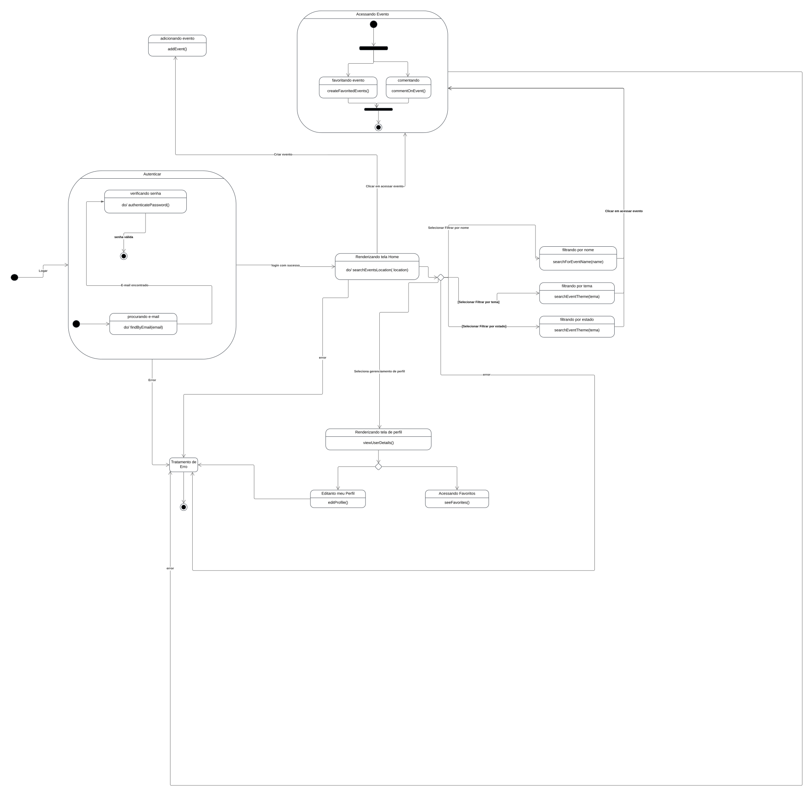

# 2.2.4 Diagrama de Estados

## Introdução

&emsp;&emsp;O diagrama de estados, também conhecido como diagrama de máquina de estados ou diagrama de transições de estados, é uma representação gráfica que descreve o comportamento de um sistema dinâmico. Ele mostra os diferentes estados pelos quais um objeto ou sistema pode passar, além de como e quando ocorrem as transições de um estado para outro, com base em eventos ou condições específicas.
 &emsp;&emsp;Esse diagrama é amplamente utilizado na modelagem de sistemas de software e hardware para entender e projetar o ciclo de vida de um objeto ou processo. Ele é fundamental no desenvolvimento de sistemas que possuem um comportamento dependente de eventos, como automação industrial, sistemas embarcados, aplicações web com interfaces complexas, e no design de protocolos de comunicação.

 &emsp;&emsp;Os principais componentes do diagrama de estados incluem:

- Estados: Representam as diferentes condições ou situações em que o sistema pode estar.

- Transições: Indicadas por setas, mostram como o sistema passa de um estado para outro em resposta a um evento.
- Eventos e condições: Fatores que acionam as transições entre estados.

 &emsp;&emsp;Esse tipo de diagrama ajuda a visualizar e definir claramente o comportamento de sistemas complexos, facilitando a comunicação entre os membros da equipe de desenvolvimento e ajudando a identificar possíveis problemas, como estados inválidos ou transições inesperadas.

## Metodologia

&emsp;&emsp;Para a elaboração deste diagrama de estados, foram realizadas consultas aos diagramas de classes e ao diagrama de atividades, a fim de proporcionar uma compreensão mais aprofundada e uma divisão clara dos estados, bem como a definição adequada das transições entre eles.

## Diagrama

Diagrama de Estados.

Autores:: [Ana Luiza][AnaGH], [Pedro Paulo][PedroPGH] , [Tales][TalesGH], 2024.

## Gravação da Reunião

&emsp;&emsp;Segue o link da gravação da reunião para desenvolvimento do diagrama de estados.

[Reunião](https://unbbr.sharepoint.com/sites/Grupo5-ArqDSW2024.2/_layouts/15/stream.aspx?id=%2Fsites%2FGrupo5%2DArqDSW2024%2E2%2FDocumentos%20Compartilhados%2FGeneral%2FRecordings%2FReuni%C3%A3o%20em%20para%20realiza%C3%A7%C3%A3o%20do%20diagram%20de%20estado%2D20241118%5F232048%2DGrava%C3%A7%C3%A3o%20de%20Reuni%C3%A3o%2Emp4&referrer=StreamWebApp%2EWeb&referrerScenario=AddressBarCopied%2Eview%2E50507529%2D9bce%2D4825%2Dae28%2D8307f376e042)

## Bibliografia

> 1. SERRANO,Milene. VídeoAula - DSW - Modelagem - Diagrama de Estados. Disponível em: [Teams](https://unbbr-my.sharepoint.com/personal/mileneserrano_unb_br/_layouts/15/stream.aspx?id=%2Fpersonal%2Fmileneserrano%5Funb%5Fbr%2FDocuments%2FArqDSW%20%2D%20V%C3%ADdeosOriginais%2F06d%20%2D%20VideoAula%20%2D%20DSW%2DModelagem%20%2D%20Estados%2Emp4&ga=1&referrer=StreamWebApp%2EWeb&referrerScenario=AddressBarCopied%2Eview%2E850a1f2a%2Df8ae%2D4267%2D953f%2Db0e5accfba65). Acesso em: 18 de nov. de 2024.
>
> 2. GUEDES, Gileanes. UML uma abordagem prática. 3ª Edição . Local de publicação: Novatec Editora, 2018. Acesso em: 18 de nov. de 2024.

## Histórico de Versões

| Versão | Data | Descrição | Autor(es) | Revisor(es) | Detalhes da revisão |
| :----: | :--: | --------- | ----------- | ------ | :---: |
| `1.0`  | 18/11/2024 | Criação do documento. |[Ana Luiza][AnaGH], [Pedro Paulo][PedroPGH] , [Tales][TalesGH]  |  |  | 

[AnaGH]: https://github.com/analufernanndess
[CainaGH]: https://github.com/freitasc
[ClaudioGH]: https://github.com/claudiohsc
[EliasGH]: https://github.com/EliasOliver21
[GuilhermeGH]: https://github.com/gmeister18
[JoelGH]: https://github.com/JoelSRangel
[KathlynGH]: https://github.com/klmurussi
[PabloGH]: https://github.com/pabloheika
[PedroRGH]: https://github.com/pedro-rodiguero
[PedroPGH]: https://github.com/Pedrin0030
[SamuelGH]: https://github.com/samuelalvess
[TalesGH]: https://github.com/TalesRG

