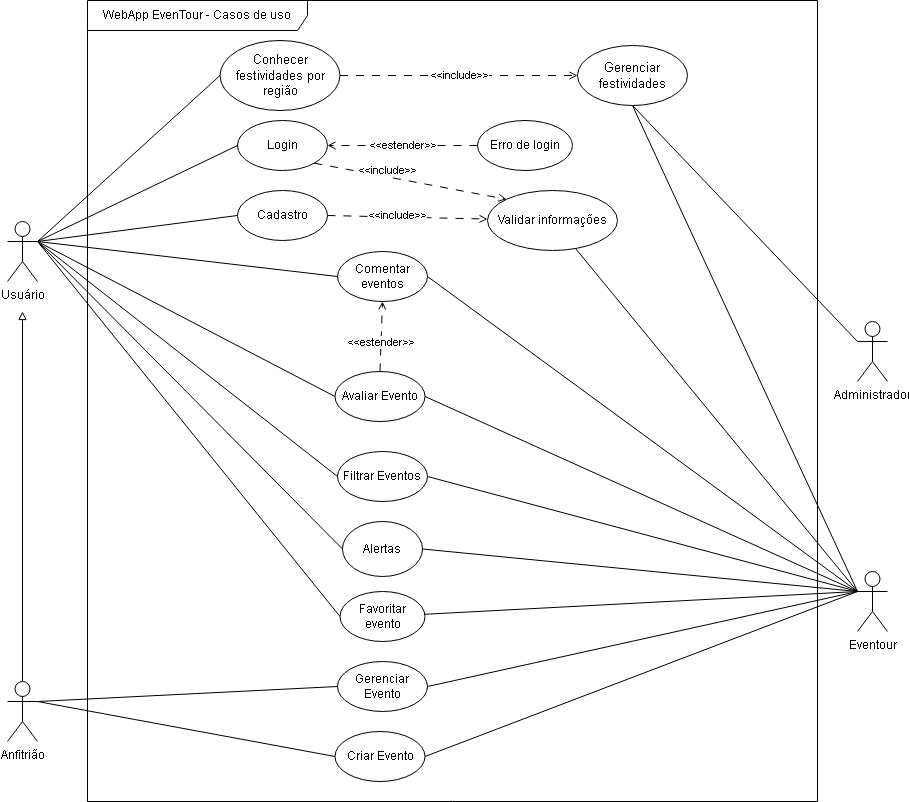

# 2.3.1 Diagrama de Caso de Uso

## Introdução

&emsp;&emsp;O diagrama de casos de uso, criado em UML, tem o propósito de representar as funcionalidades de um sistema do ponto de vista dos usuários. 
Ele fornece uma visão externa do sistema, permitindo compreender como os atores interagem com as funcionalidades oferecidas.  &emsp;&emsp; 
Ele facilita a identificação das funcionalidades necessárias e auxilia no planejamento e validação do escopo do sistema.  &emsp;&emsp; 
Um caso de uso é uma descrição de uma funcionalidade específica que o sistema deve realizar, enquanto um ator é uma entidade externa (como um usuário ou outro sistema) 
que interage com o sistema para alcançar um objetivo específico.

## Metodologia

&emsp;&emsp;A equipe responsável pelo diagrama de caso de uso reuniu-se para analisar as funcionalidades do sistema. Com base nessa análise, foram identificados os pontos de vista dos usuários e elaborado o diagrama.

&emsp;&emsp;A confecção do diagrama foi feita utilizando o software <a href="https://app.diagrams.net/" target="blank">Draw.io</a>.

## Diagrama

Figura 1: Diagrama de Caso de Uso.

Fonte: [Elias Oliveira](https://github.com/EliasOliver21), [Joel Soares](https://github.com/JoelSRangel), [Kathlyn Lara Murussi](https://github.com/klmurussi), [Pablo S. Costa](https://github.com/pabloheika), [Pedro Paulo](https://github.com/Pedrin0030) e [Samuel Alves](https://github.com/samuelalvess), 2024.

## Bibliografia

> 1. UML use case diagrams with draw.io. Disponível em: https://drawio-app.com/blog/uml-use-case-diagrams-with-draw-io/ <strong>Acesso em: 25 de nov. de 2024</strong>.
>

## Histórico de Versão

| Versão |    Data    | Descrição | Autor(es)                       | Revisor(es)                          | Detalhes da revisão |
| :----: |:----------:| --------- |---------------------------------|--------------------------------------| :---: |
|`1.0`| 25/11/2024 | Criação do documento| [Ana Luíza Fernandes][AnaGH] e [Tales Rodrigues Gonçalves][TalesGH] | [Ana Luíza Fernandes][AnaGH] e [Tales Rodrigues Gonçalves][TalesGH] | Não foram encontrados erros na criação do artefato. |

[AnaGH]: https://github.com/analufernanndess
[CainaGH]: https://github.com/freitasc
[ClaudioGH]: https://github.com/claudiohsc
[EliasGH]: https://github.com/EliasOliver21
[GuilhermeGH]: https://github.com/gmeister18
[JoelGH]: https://github.com/JoelSRangel
[KathlynGH]: https://github.com/klmurussi
[PabloGH]: https://github.com/pabloheika
[PedroGH]: https://github.com/pedro-rodiguero
[PedroPGH]: https://github.com/Pedrin0030
[PedroGH]: https://github.com/pabloheika
[SamuelGH]: https://github.com/samuelalvess
[TalesGH]: https://github.com/TalesRG
