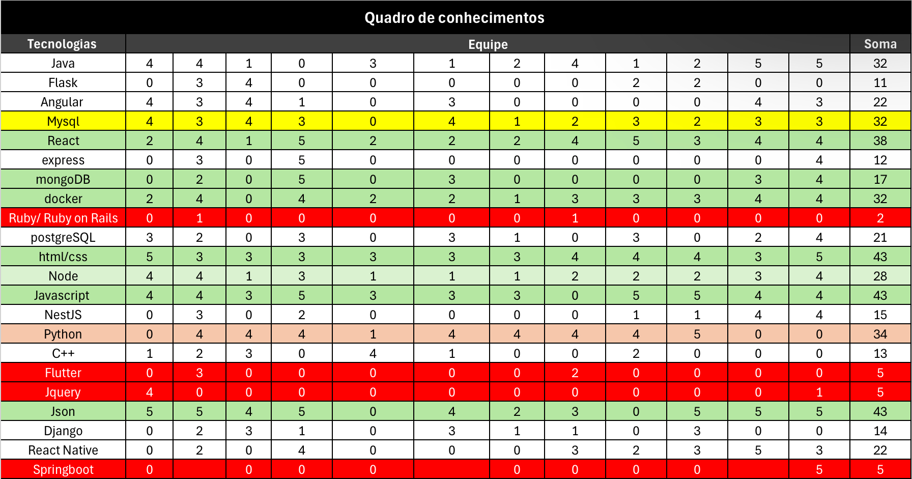

# 2.5.1. Quadro de Conhecimentos

## Introdução

Este artefato tem o objetivo de apresentar o quadro de conhecimentos criado pelo grupo no foco 01 da segunda entrega. Para avançar com o projeto deveríamos definir as tecnologias, e para isso foi feito o quadro de conhecimentos para decidirmos as tecnologias e frameworks utilizados no desenvolvimento do projeto da forma mais justa e democrática.

## Metodologia

Para construir o quadro criamos um documento compartilhado no [Microsoft Excel](https://www.microsoft.com/pt-br/microsoft-365/excel) onde cada membro foi elencando livremente as tecnologias e frameworks que conhecia e via compatibilidade/viabilidade para utilizar no projeto. Após elencarmos as tecnologias criamos uma coluna para cada membro enumeramos de 0 a 5 a suas habilidades e conhecimentos com aquela tecnologia e framework. A reunião foi gravada e se encontra na [ata-03](../atas/ata_03.md)

## Quadro de Conhecimentos

Na figura 1 temos o quadro realizado pala equipe.

Figura 1: Quadro de Conhecimentos.

Fonte: [Pablo S. Costa][PabloGH], 2024.

## Bibliografia

> 1. Matriz de Competências. Disponível em:  [https://medium.com/@monteiro.thiago/matriz-de-compet%C3%AAncia-61a8448dd141](https://medium.com/@monteiro.thiago/matriz-de-compet%C3%AAncia-61a8448dd141) . Acesso em: 19 de nov. de 2024.
>
> 2. Quadro de Conhecimento. O que é? Como funciona? Benefícios. Disponível em:  [https://aulanotadez.com.br/glossario/oa-que-e-quadro-de-conhecimento/](https://aulanotadez.com.br/glossario/oa-que-e-quadro-de-conhecimento/) . Acesso em: 19 de nov. de 2024.
>
> 3. All About Heatmaps. Disponível em: [https://towardsdatascience.com/all-about-heatmaps-bb7d97f099d7](https://towardsdatascience.com/all-about-heatmaps-bb7d97f099d7). Acesso em: 19 de nov. de 2024.
>

## Histórico de Versão

| Versão | Data | Descrição | Autor | Revisor|Detalhes da Revisão|
|:-:|:-:|:-:|:-:|:-:|:-:|
|`1.0`| 19/11/2024 | Criação do documento| [Elias Oliveira][EliasGH] e [Pablo][PabloGH]|[Cláudio Henrique][ClaudioGH] |Foi corrigido alguns erros gramaticais e o histórico de versão.|
|`1.1`| 28/11/2024 | Adicionando Bibliografia| [Elias Oliveira][EliasGH] e [Pablo][PabloGH]|[Cláudio Henrique][ClaudioGH] |Foi corrigido alguns erros gramaticais e o histórico de versão.|

[AnaGH]: https://github.com/analufernanndess
[CainaGH]: https://github.com/freitasc
[ClaudioGH]: https://github.com/claudiohsc
[EliasGH]: https://github.com/EliasOliver21
[GuilhermeGH]: https://github.com/gmeister18
[JoelGH]: https://github.com/JoelSRangel
[KathlynGH]: https://github.com/klmurussi
[PabloGH]: https://github.com/pabloheika
[PedroRH]: https://github.com/pedro-rodiguero
[PedroPGH]: https://github.com/Pedrin0030
[SamuelGH]: https://github.com/samuelalvess
[TalesGH]: https://github.com/TalesRG
