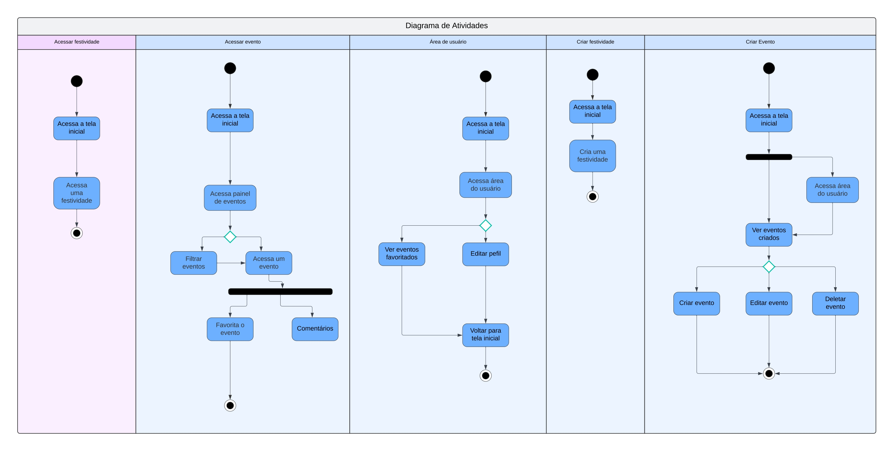

# **Diagrama de Atividades**

## **Introdução**

O presente documento descreve o diagrama de atividades referente ao fluxo de acesso e gerenciamento de festividades e eventos. Este diagrama foi desenvolvido com o objetivo de ilustrar os principais fluxos de ações e decisões. A representação gráfica segue os padrões de notação UML, abrangendo as seguintes funcionalidades:

1. **Acessar festividade**: fluxo básico de interação inicial para visualizar uma festividade.
2. **Acessar evento**: interação para filtrar, acessar e gerenciar eventos.
3. **Área de usuário**: funcionalidades de personalização e visualização de preferências.
4. **Criar evento**: fluxo de criação, edição e exclusão de eventos.

Os principais elementos do diagrama incluem estados, decisões condicionais e atividades realizadas durante a interação.

## **Metodologia**

Para a elaboração do diagrama de atividades, a equipe decidiu dividir as responsabilidades de maneira que não sobrecarregasse ninguém. Dois membros se reuniram para criar o diagrama, aplicando técnicas de modelagem de processos e destacando os principais fluxos de navegação do usuário no sistema. Enquanto isso, outro membro ficou responsável pela criação deste documento. 

Para criar o diagrama, utilizamos o o software <a href="https://www.lucidchart.com/" target="blank">Lucidchart</a>.

## **Desenvolvimento**

O diagrama de atividades está segmentado em diferentes fluxos funcionais, cada um representando um conjunto de ações específicas realizadas pelo usuário no sistema:

### **Fluxo 1: Acessar Festividade**
- O usuário inicia na tela inicial do sistema.
- Navega até uma festividade específica.
- Encerramento do processo ao visualizar a festividade.

### **Fluxo 2: Acessar Evento**
- O usuário acessa o painel de eventos a partir da tela inicial.
- Pode optar por **filtrar eventos** ou **acessar um evento diretamente**.
- Após acessar um evento, é possível:
  - **Favoritar o evento.**
  - **Adicionar comentários sobre o evento.**

### **Fluxo 3: Área de Usuário**
- O usuário acessa sua área pessoal após a tela inicial.
- As ações disponíveis incluem:
  - **Ver eventos favoritados.**
  - **Editar perfil do usuário.**
- É possível retornar à tela inicial a qualquer momento.

### **Fluxo 4: Criar Evento**
- O processo inicia com o acesso à área do usuário.
- Na aba de eventos criados, o usuário pode:
  - **Criar um novo evento.**
  - **Editar um evento existente.**
  - **Deletar um evento.**

**Figura 1: Diagrama de Atividades**

**Autores**: [Joel Rangel][JoelGH], [Kathlyn Lara][KathlynGH], 2024.

**Tabela 1: Resumo das Atividades**

| **Fluxo**         | **Atividade Principal**         | **Descrição**                                                                 |
| :----------------: | ------------------------------- | ----------------------------------------------------------------------------- |
| Acessar Festividade | Visualização de festividades    | O usuário acessa informações sobre uma festividade específica.                |
| Acessar Evento      | Gerenciamento de eventos       | Filtrar, acessar, favoritar ou comentar eventos.                              |
| Área de Usuário     | Personalização e preferências  | Ver eventos favoritados ou editar o perfil.                                   |
| Criar Evento        | Criação e edição de eventos    | Criar, editar ou deletar eventos na área do usuário.                          |

**Autor**: [Samuel Alves][SamuelGH], 2024.

## Gravação da Reunião

Vídeo 1: Gravação da reunião da realização do Diagrama de Atividades.

<iframe width="560" height="315" 
  src="https://www.youtube.com/embed/NSocxGJ7qnk" 
  frameborder="0" 
  allow="accelerometer; autoplay; clipboard-write; encrypted-media; gyroscope; picture-in-picture" 
  allowfullscreen>
</iframe>

Participantes: [Kathlyn Lara](KathlynGH) e [Joel Rangel](JoelGH).

Data: 18 de novembro de 2024. 

## **Bibliografia**

> 1. IBM. Activity diagrams. Disponível em: https://www.ibm.com/docs/pt-br/rational-soft-arch/9.7.0?topic=diagrams-activity. Acesso em: 20 nov. 2024.
>
> 2. UML DIAGRAMS. UML Activity Diagrams Overview. Disponível em: https://www.uml-diagrams.org/activity-diagrams.html. Acesso em: 27 nov. 2024.
>
> 3. CIN UFPE. Activity Diagram in the Business Use-Case Model. Disponível em: https://www.cin.ufpe.br/~gta/rup-vc/extend.bus_model/guidances/guidelines/activity_diagram_in_the_business_use-case_model_5862EB50.html. Acesso em: 27 nov. 2024.
---

## **Histórico de Versões**

| **Versão** | **Data**       | **Descrição**               | **Autor(es)**       | **Revisor(es)** | **Detalhes da Revisão** |
| :--------: | -------------- | --------------------------- | ------------------- | --------------- | ----------------------- |
| `1.0`      | 21/11/2024     | Criação do documento        | [Samuel Alves][SamuelGH] | [Kathlyn Murussi](KathlynGH) | Adicionei mais referências de bibliografia que foram utilizadas e a gravação da reunião |

[AnaGH]: https://github.com/analufernanndess  
[CainaGH]: https://github.com/freitasc  
[PabloGH]: https://github.com/pabloheika
[AnaGH]: https://github.com/analufernanndess
[CainaGH]: https://github.com/freitasc
[ClaudioGH]: https://github.com/claudiohsc
[EliasGH]: https://github.com/EliasOliver21
[GuilhermeGH]: https://github.com/gmeister18
[JoelGH]: https://github.com/JoelSRangel
[KathlynGH]: https://github.com/klmurussi
[PabloGH]: https://github.com/pabloheika
[PedroRGH]: https://github.com/pedro-rodiguero
[PedroPGH]: https://github.com/Pedrin0030
[SamuelGH]: https://github.com/samuelalvess
[TalesGH]: https://github.com/TalesRG
