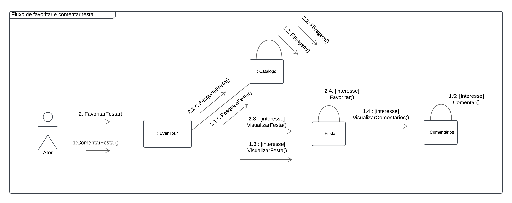
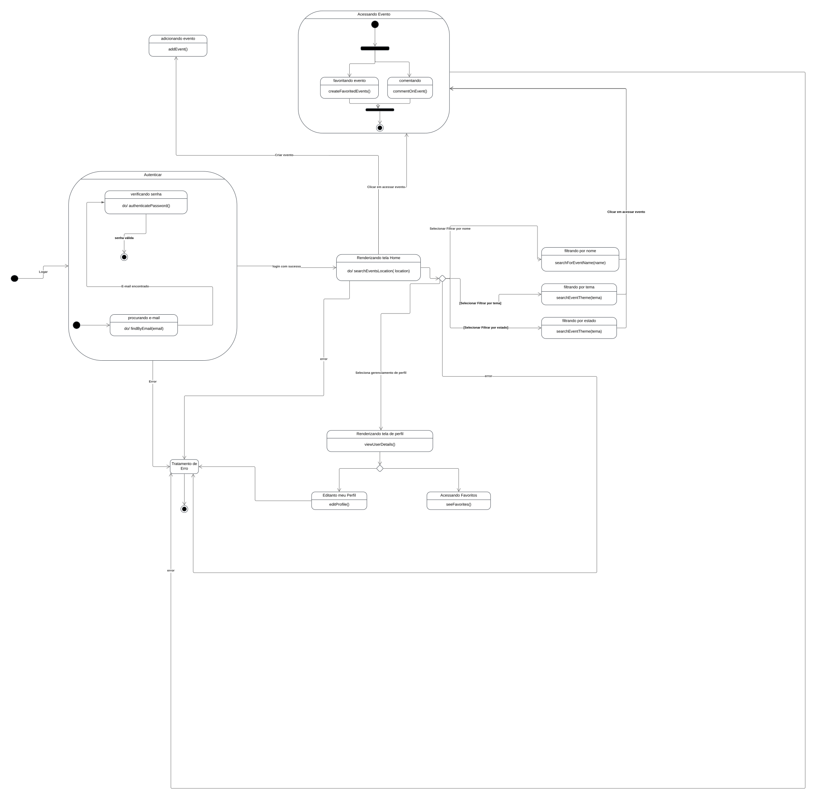
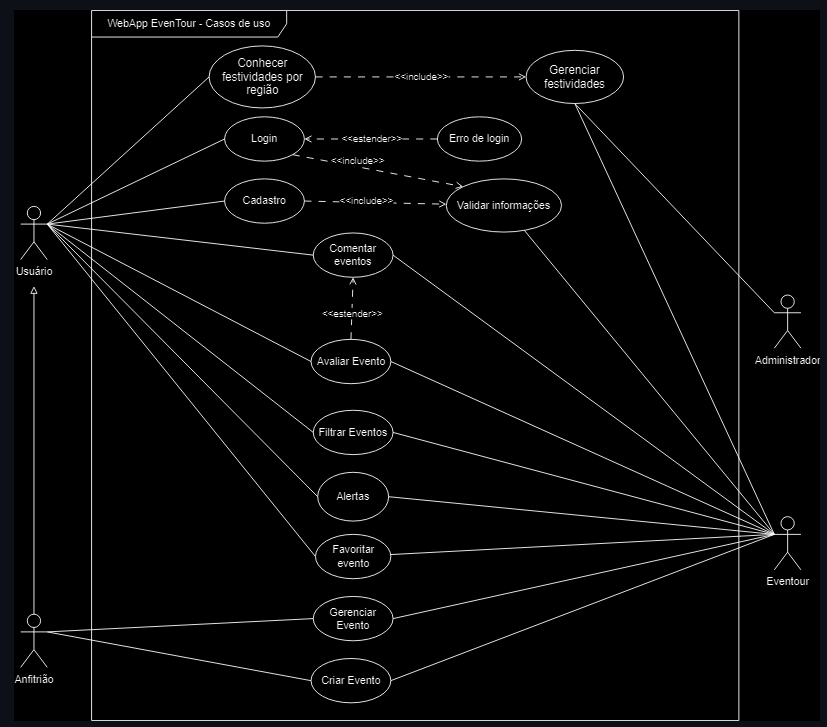

# EvenTour

**Código da Disciplina**: FGA0208 
**Número do Grupo**: 05 
**Entrega**: 02 

## Alunos
|Foto| Matrícula | Aluno |
| :--: | :--: | :--: |
|| 21/1030667  | [Ana Rocha][AnaGH]| 
|| 18/0014412  | [Cainã][CainaGH] |
|| 22/1007958  | [Cláudio Carvalho][ClaudioGH] |
|| 22/1007706  | [Elias Oliveira][EliasGH] |
|| 20/2016382  | [Guilherme Correa][GuilhermeGH] |
|| 21/1039546  | [Joel Rangel][JoelGH] |
|| 18/0042378  | [Kathlyn Murussi][KathlynGH] |
|| 18/0128817  | [Pablo Costa][PabloGH] |
|| 22/1008688  | [Pedro Paulo][PedroPGH] |
|| 19/0139323  | [Pedro Rodiguero][PedroRGH] |
|| 20/2063462  | [Samuel Silva][SamuelGH] |
|| 21/1041295  | [Tales Gonçalves][TalesGH] |

## Sobre 

O Projeto Eventour surge como um trabalho da disciplina de arquitetura e desenho de software da Unb - FCTE(Faculade de Ciências e Tecnologias em Engenharia). O Eventour é um Web/App informativo que apresenta eventos relacionados a festas típicas que ocorrem sazonalmente, ele possibilita a filtragem dos eventos por tema e local do usuário.

## Screenshots da Primeira Entrega
Abaixo são apresentados exemplos de artefatos produzidos na entrega 02 - (DSW)Modelagem.

### Modelagem Estática

#### Diagrama de Classes

#### Diagrama de Componentes

### Modelagem Dinâmica

#### Diagrama de Sequência

#### Diagrama de Atividades

#### Diagrama de Comunicação/Colaboração

#### Diagrama de Estados

### Modelagem Organizacional

#### Diagrama de Pacotes

#### Diagrama de Casos de Uso

## Há algo a ser executado?

( ) SIM

( x ) NÃO

Se SIM, insira um manual (ou um script) para auxiliar ainda mais os interessados na execução.

## Informações Complementares

Nenhuma informação adicional.

## Histórico de Versões

| Versão | Data | Descrição | Autor(es) | Revisor(es) | Detalhes da revisão |
| :----: | :--: | --------- | ----------- | ------ | :---: |
| `1.0`  | 28/11/2024 | Criação do documento | [Elias Oliveira][EliasGH] |  |  |

[AnaGH]: https://github.com/analufernanndess
[CainaGH]: https://github.com/freitasc
[ClaudioGH]: https://github.com/claudiohsc
[EliasGH]: https://github.com/EliasOliver21
[GuilhermeGH]: https://github.com/gmeister18
[JoelGH]: https://github.com/JoelSRangel
[KathlynGH]: https://github.com/klmurussi
[PabloGH]: https://github.com/pabloheika
[PedroRGH]: https://github.com/pedro-rodiguero
[PedroPGH]: https://github.com/Pedrin0030
[SamuelGH]: https://github.com/samuelalvess
[TalesGH]: https://github.com/TalesRG